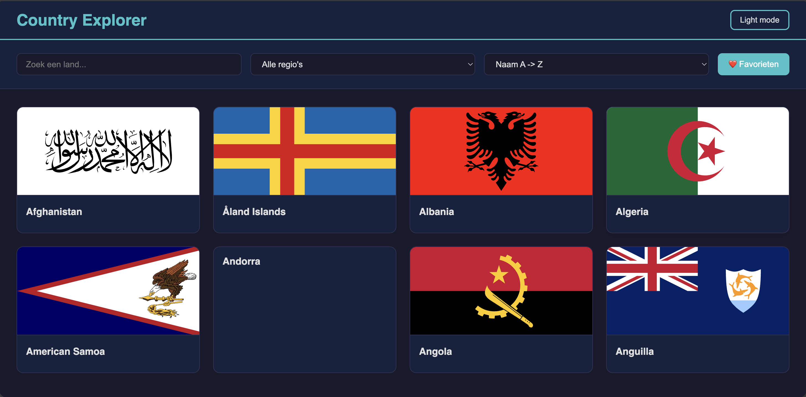
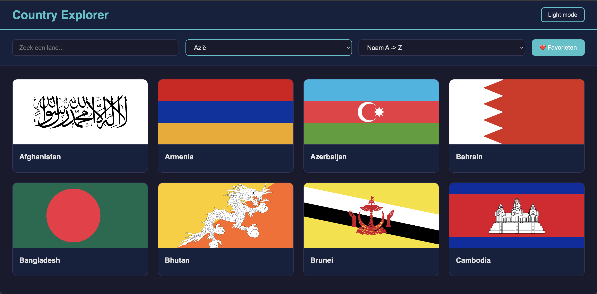
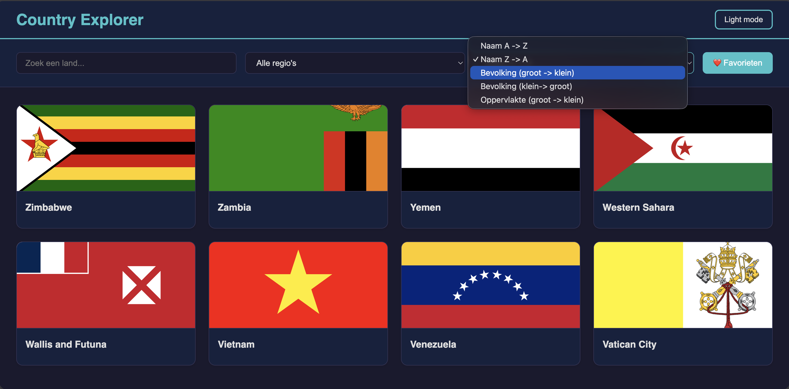
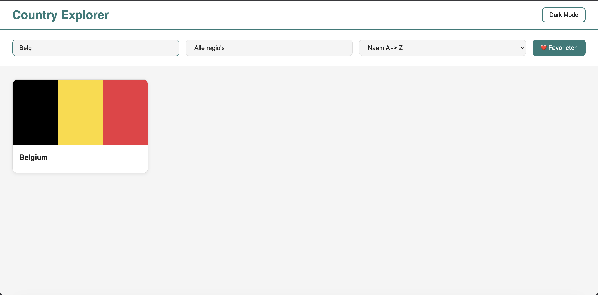
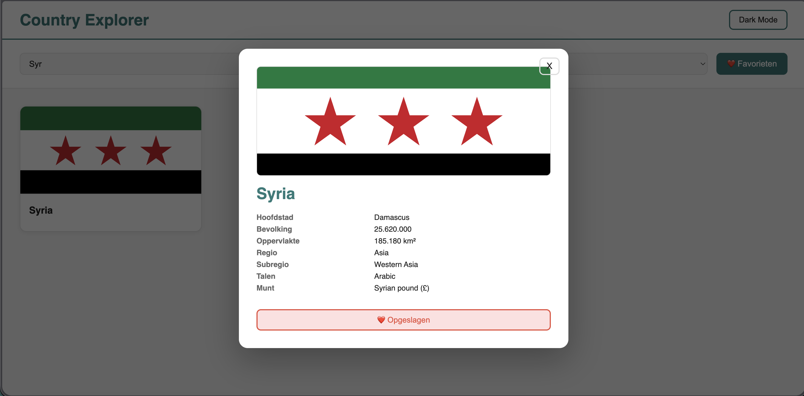
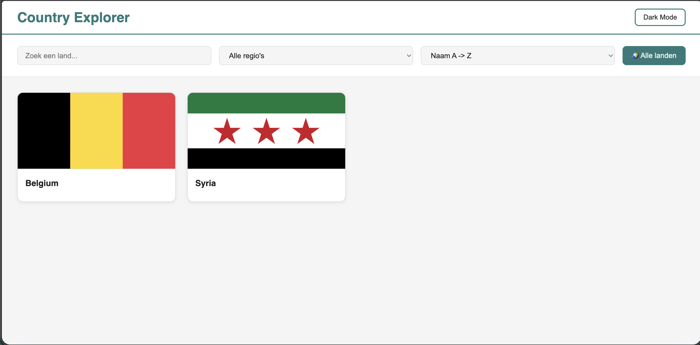
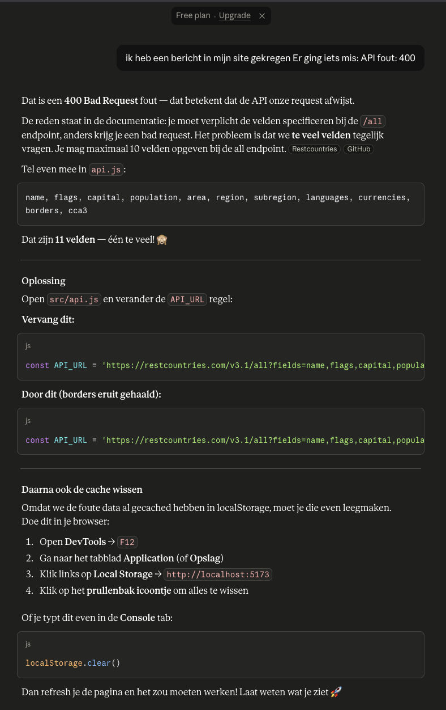
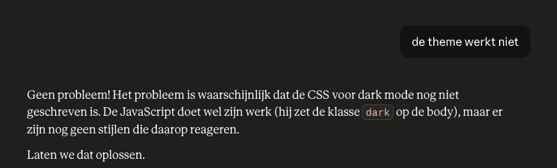
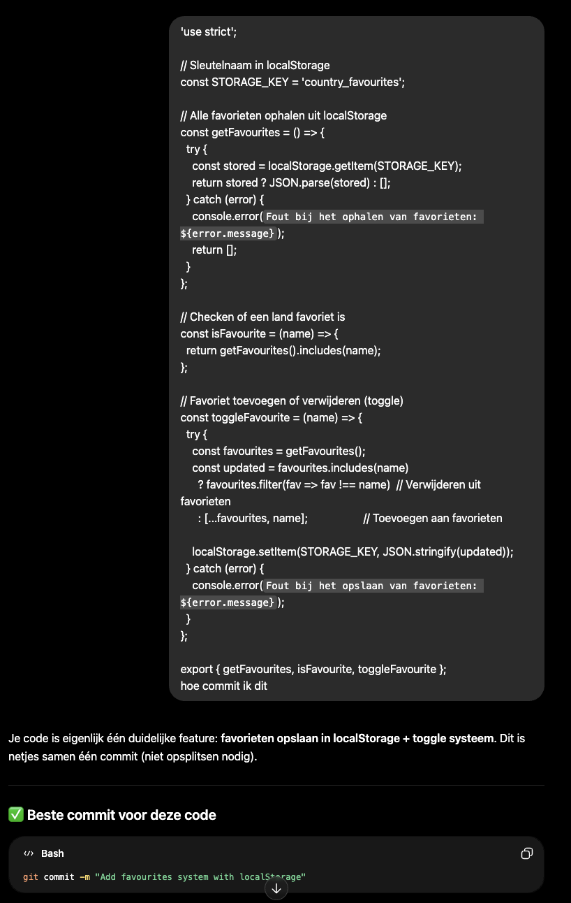

# Country Explorer
Een interactieve single-page applicatie voor het vak Web advanced. 
Je kan hiermee alle landen van de werled bekijken, filtreren, sorteren en als favoriet opslaan.

---

## Waarom Rest countries?
Ik koos voor een landen-applicatie omdat ik het interessant vond om met echte data van verschillende landen te werken. De REST countries API bevat veel nuttige informatie zoals vlaggen, bevolking, talen, regio's en munteenheden. Daardoor was het mogelijk om een interactieve applicatie maken met filtering, sortering, favoriete en detailweergave.

---

## Wat doet de app?
- Alle landen ophalen via de REST countries API.
- Kaartweergave met vlag, naam en basisinfo per land.
- Tabelweergave met 7 kolommen (naam, hoofdstad, bevolking, oppervlakte, regio, subregio, talen, munteenheid)
- Zoeken op landnaam.
- Filteren op regio (Afrika, Amerika, Azië, Europa, Oceanië)
- Sorteren op naam, bevolking en oppervlakte
- Favorieten toevoegen en verwijderen (blijft bewaard na sluiten van de browser)
- Dark/Light mode (voorkeur wordt onthouden)
- Detailmodal per land met vlag, alle status en buurlanden

---

## Gebruikte API
### REST countries v3.1, https://restcountries.com/
**Gebruikte endpoints**
https://restcountries.com/v3.1/all?fields=name,flags,capital,population,area,region,subregion,languages,currencies,cca3'

Gratis, geen API-sleutel nodig. 

---

## Installatie
``` bash
npm install
npm run dev
```

---

## Mappenstructuur
``` bash
countryexplorer/
├── index.html
├── package-lock.json
├── package.json
├── .gitignore
├── node_modules/
├── src/
    ├── style/
        ├── card.css
        ├── main.css
        ├── modal.css
    ├── api.js
    ├── favourite.js
    ├── filter.js
    ├── main.js
    ├── render.js
    ├── theme.js

```

---

## Technische vereisten
### DOM manipulatie
- **ELementen selecteren:** `src/main.js` regel 9 (`document.getElementById` voor alle UI-elementen)   
- **Elementen manipuleren:** `src/render.js` regel 38 (`innerHTML`, `classList`, `appendChild`)
- **Events koppelen:** `src/main.js` regel 45+ (alle `addEventListener` calls)

### Moderne JavaScript
- **const / let :** `const` overal voor vaste waarden (`src/api.js` regel 2), `let` voor veranderlijke state (`src/main.js` regel 17-18)
- **Template literals:**  `src/render.js` regel 38 (HTML opbouwen met backticks en `${}`)
- **Array iteratie:**  `src/render.js` regel 65 (`forEach` over landen)

- **Array methodes**
  - `src/filter.js` regel 12 (`.filter()`)
  - `src/filter.js` regel 22 (`.sort()`)
  - `src/favourites.js` regel 15 (`.filter()` voor verwijderen)
  - `src/render.js` regel 22 (`Object.values().join()` voor talen)

- **Arrow functions:** overal gebruikt als kortere functienotatie
- **Ternary operator:** `src/render.js` regel 32 (favorietknop tekst: `fav ? '❤️ Opgeslagen' : '🤍 Favoriet'`)
- **Callback functions:**  bij alle `addEventListener` en array methodes
- **Promises:** `src/api.js` regel 18 (`fetch()` geeft een Promise terug)
- **Async/Await:** `src/api.js` regel 8 (`fetchCountries`), `src/main.js` regel 75 (`init`)
- **Observer API:** `src/main.js` regel 60 (`IntersectionObserver` voor kaartanimaties bij scrollen)

### Data & API

- **Fetch** : `src/api.js` regel 18 en 20  
- **JSON** : `src/api.js` regel 22 (`response.json()`), regel 24-10 (`JSON.stringify` / `JSON.parse` voor cache)  


### Opslag & validatie

- **Formuliervalidatie** : `src/filter.js` regel 10 (zoekterm van 1 karakter wordt genegeerd)  
- **LocalStorage** : `src/api.js` (API cache), `src/favourites.js` (favorieten), `src/theme.js` (themavoorkeur)  

### Styling & layout

- **CSS Grid** : `src/styles/cards.css` (`.countries-grid`, `grid-template-columns: repeat(auto-fill, minmax(280px, 1fr))`)  
- **Flexbox** : `src/styles/main.css` (`.header`, `.controls`)  
- **Verwijderknoppen/iconen** : favorietknoppen op kaartjes, in modal en in favorietenweergave  

### Tooling

- **Vite** : `vite.config.js`, `package.json` (scripts: `dev` / `build` / `preview`)  
- **Folderstructuur** : aparte html, css en js-bestanden onder `src/`  


---

## Gebruikersvoorkeuren (LocalStorage)


| Sleutel | Wat wordt opgeslaan 
|---|---|
| theme | `dark` of `light`  
| country_favourite | array van favourite landnamen 
| countries_cache | volledig API-response (snellere herhaaltijd)

---

## Screenshots








---

## Bronnen

- REST Countries API : https://restcountries.com/  
- MDN IntersectionObserver : https://developer.mozilla.org/en-US/docs/Web/API/Intersection_Observer_API  
- MDN Fetch API : https://developer.mozilla.org/en-US/docs/Web/API/Fetch_API  
- MDN LocalStorage : https://developer.mozilla.org/en-US/docs/Web/API/Window/localStorage  
- MDN Array methodes : https://developer.mozilla.org/en-US/docs/Web/JavaScript/Reference/Global_Objects/Array  
- Vite docs : https://vitejs.dev/  
- Claude (Anthropic) : gebruikt voor uitleg van bepaalde concepten en debuggen  

---

## AI chatlog




